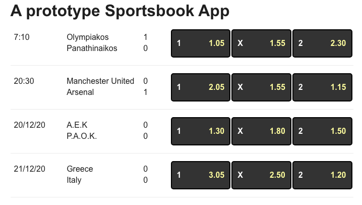
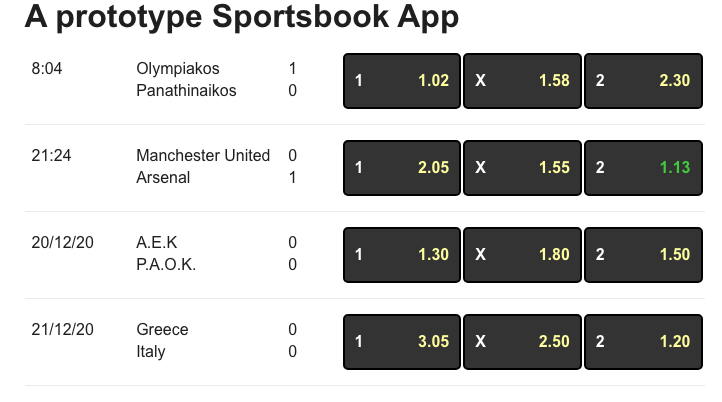
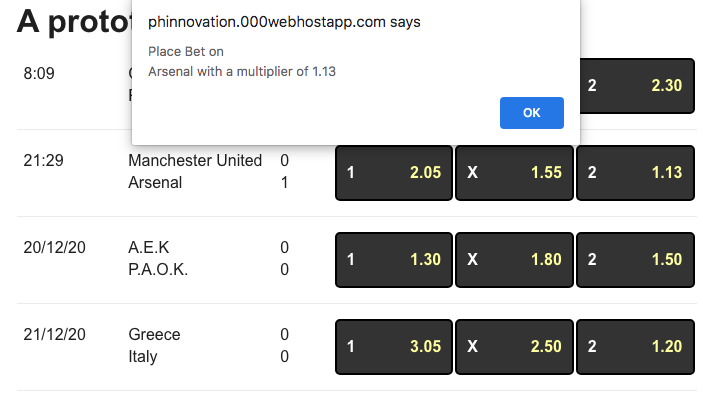

# A SportsBook ReactJS prototype

Demo Available here: http://phinnovation.000webhostapp.com/react-prototype/sportsbook/

## Quick Description

A number of components can be found in src/components/

All logic is kept at SportsBookContainer.js which contains a Header and GamesList component.

The GamesList component adds a number of GameItem components that finally contain three Bet1x2 components responsible for showing the bet multipliers for a home win , draw, or away win.

On user click the Bet1x2 component propagates the even up to to the SportsBookContainer which shows in an alert the bet the user clicked.

A number of checks are made there that the bet is still available and that the multiplier has not changed between user interaction and now.

The initial data are fetched (as a json array ) from here:

http://phinnovation.000webhostapp.com/react-prototype/sportsbook/backend/

The structure of each item/game is:

```
{
  "id":1,
  "live": 1,                //1 for live or 0
  "time": 420,              //set when live
  "date": "",               //future date when live 0
  "home": "Olympiakos",
  "away": "Panathinaikos",
  "home_goals":1,
  "away_goals":0,
  "bet_1": 105,
  "bet_x": 155,
  "bet_2": 230
}
```

time is in seconds
bet multipliers are sent as integers to avoid floating point issues/comparisons

When displayed they are divided by 100 and shown with 2 decimal places

A wait loading message is shown while initially waiting for data and then the GamesList component is used.

As soon as the server data are here, a websocket is opened to the echo service here:

wss://echo.websocket.org

and every 15 seconds we grab a random live game, update one of each 1,x,2 multipliers and send it to the echo server to emulate a real server sending new live data.

As soon as the data is back, we update the state of the react app in order to show the changed data.

The new multiplier/bet becomes green for 5 seconds so the user can see that a bet changed.

The app is responsive but not much time was spent on the visual/css side of the app. It can become better :)

## Some screens:

### Initial View:



### New bet multiplier received:



### User click on a game:


